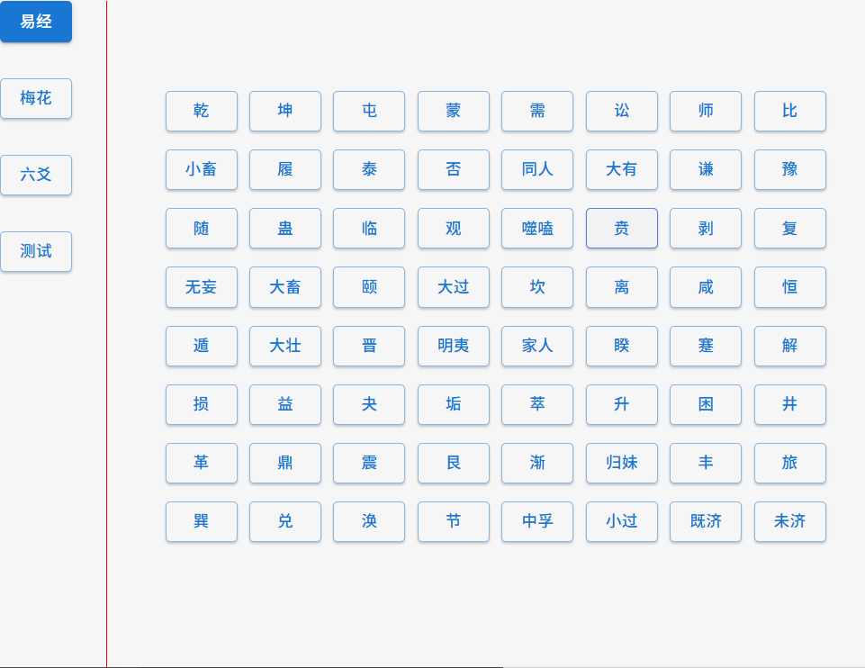
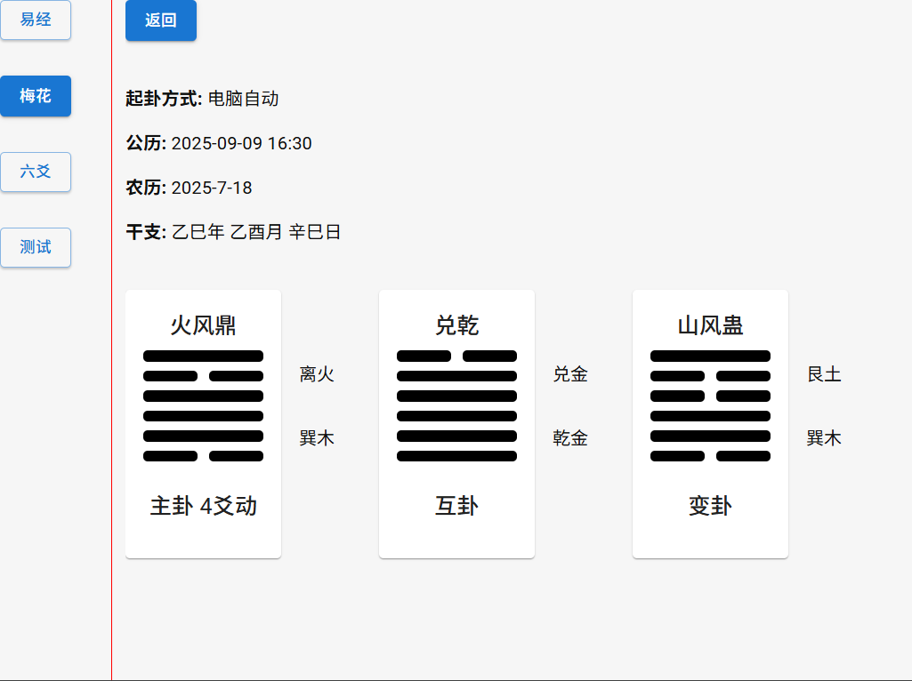
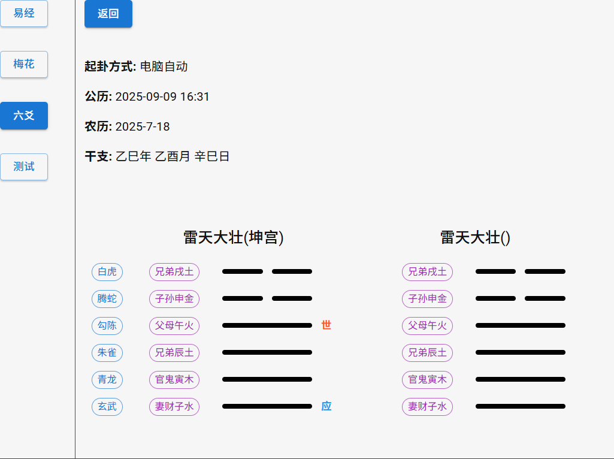

# Tauri + React + Typescript

This template should help get you started developing with Tauri, React and Typescript in Vite.

## start
1. pnpm install
2. pnpm tauri dev

## Recommended IDE Setup
- [VS Code](https://code.visualstudio.com/) + [Tauri](https://marketplace.visualstudio.com/items?itemName=tauri-apps.tauri-vscode) + [rust-analyzer](https://marketplace.visualstudio.com/items?itemName=rust-lang.rust-analyzer)
- [RustRover](https://www.jetbrains.com/rust/)
- [WebStorm](https://www.jetbrains.com/webstorm/)

## 鸣谢 / Thanks
感谢 JetBrains 提供的开源许可证。

